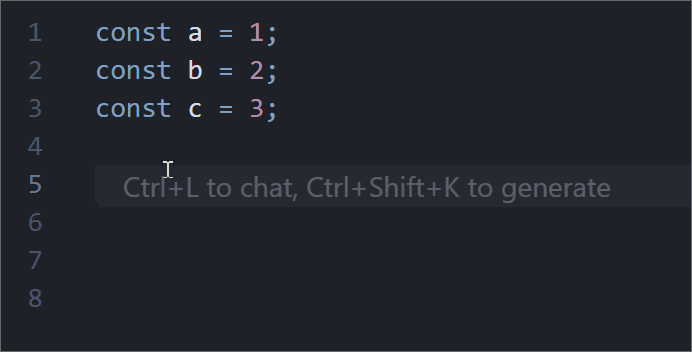

# Cursor JS Console Utils

在 Cursor / VS Code 中快速插入 `console.log` 语句。灵感来自 [vscode-js-console-utils](https://github.com/whtouche/vscode-js-console-utils)



## 功能

- **无选区时**：在光标处插入空白 `console.log();`，光标停留在括号内，方便直接输入变量或表达式。
- **有选区时**：根据选中的文本，在**最后一处选区所在行的末尾**插入带标签的日志，格式为：
  ```js
  console.log('变量名: ', 变量名);
  ```
- **多选区**：支持多处选区，会按在文档中的先后顺序，一次性插入多行 `console.log`，每行对应一个选区。

## 安装

### 从cursor拓展市场安装(推荐)
搜索 Cursor JS Console Utils 并安装

### 从 VSIX 安装

1. 在项目根目录执行：`npm run pkg`
2. 在 VS Code / Cursor 中：按 **Ctrl+Shift+P** → 输入 **Install from vsix** → 选择生成的 `.vsix` 文件。

## 使用方式

1. **命令面板**：`Ctrl+Shift+P`（Windows/Linux）或 `Cmd+Shift+P`（macOS），输入并选择 **“Insert console.log for selection”**。
2. **快捷键**：`Shift+Alt+L`。

### 使用示例

| 操作 | 结果 |
|------|------|
| 光标在某行，无选区，执行命令 | 在该位置插入 `console.log();` |
| 选中变量 `userName`，执行命令 | 在该行下方插入 `console.log('userName: ', userName);` |
| 多选 `a`、`b`、`c`（三处选区），执行命令 | 在最后选区所在行下方插入三行：`console.log('<var>: ', <var>);` 

## 注意事项

- **语言无关**：扩展不区分语言，任何文件类型下都会插入 `console.log`。若在非 JavaScript/TypeScript 文件中使用，请自行确认是否符合项目习惯（如删除或替换为对应语言的打印方式）。
- **插入位置**：有选区时，所有日志行都插入在**最后一处选区所在行的行末**（换行后），不会在每处选区后分别插入。
- **快捷键冲突**：`Shift+Alt+L` 可能与其他扩展或系统快捷键冲突，可在 **键盘快捷方式** 中搜索 `Insert console.log for selection` 自行修改。

## 环境要求

- **VS Code** 版本 ≥ 1.75.0（或兼容的 Cursor 版本）。

## 许可证

MIT License，详见 [LICENSE](LICENSE)。

## TODO
- ~~当插入空log时，若当前行有内容，自动换行并插入下一行~~
- 支持多语言（python、Java）